# Aplikasi Pencatatan STPL - STPLAPP

Sistem pencatatan Surat Tanda Penerimaan Laporan (STPL) untuk Laporan Kehilangan dan Barang Temuan yang dibuat dengan:

- C#
- Windows Forms
- MySQL
- ADO.NET (MySql.Data)

## Fitur Utama

- Tes koneksi database
- Autentikasi Login
- CRUD
- CREATE: Tambah data (Laporan Hilang & Barang Temuan)
- UPDATE: Ubah detail data & status barang
- DELETE: Hapus data laporan
- READ: Menampilkan data pada DataGridView
- Fitur pencarian

## Tampilan Aplikasi

### Tes Koneksi
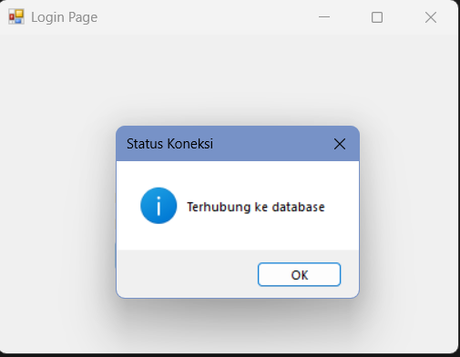

### Halaman Login
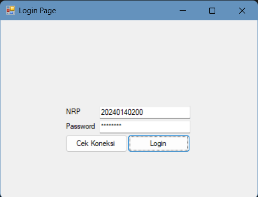

### Menu Utama
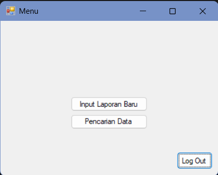

### Halaman Input Data
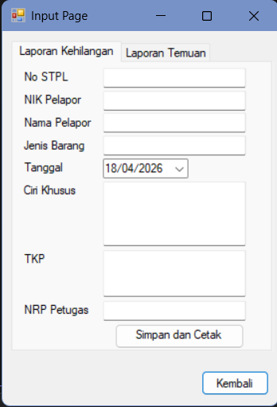
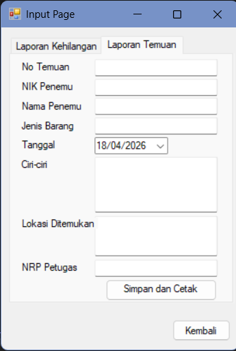

### Bukti Simpan Data Sukses
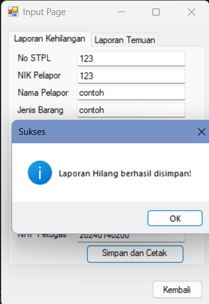

### Tampilan Data (Gudang)
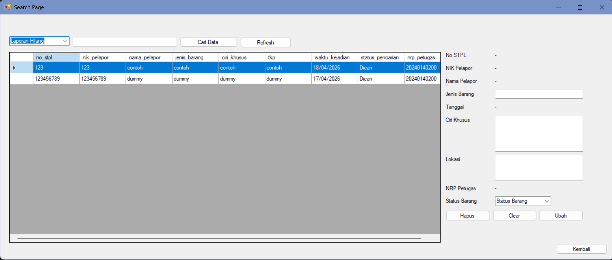

### Hasil Pencarian Data
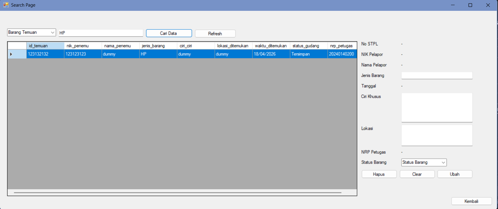

### Bukti Ubah Data Sukses
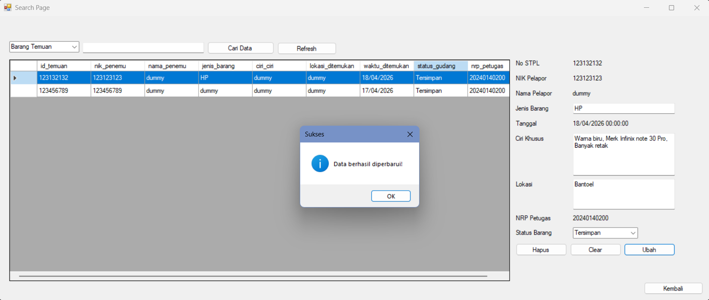

### Bukti Hapus Data Sukses
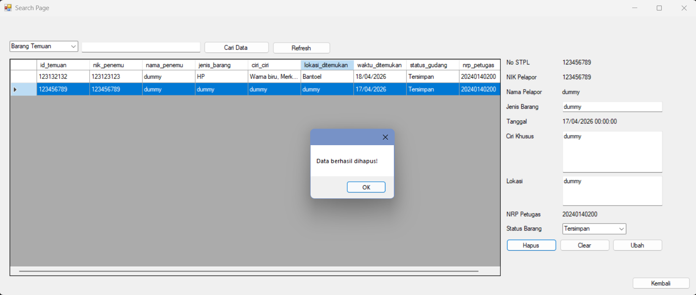

## Lampiran

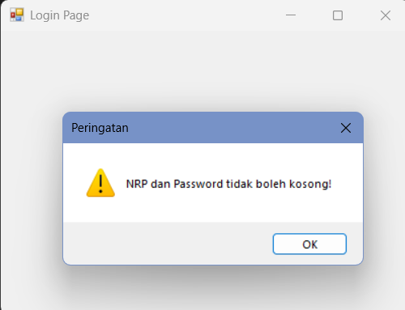
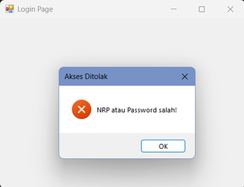
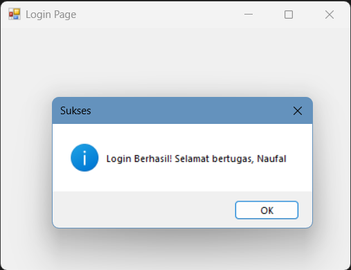

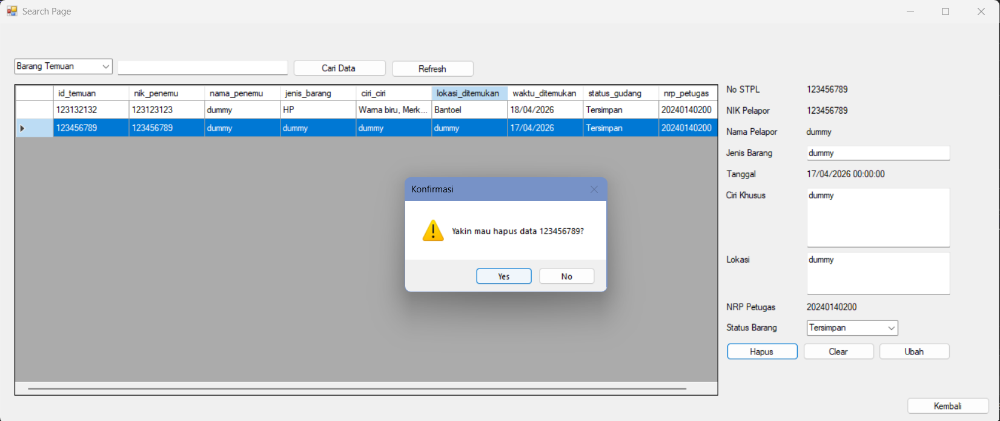
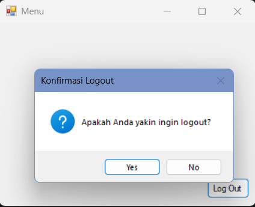